# LedgerLens Revenue Truth System (LRTS)

A production-quality, end-to-end fintech data platform that establishes a single, auditable source of truth for payment revenue. The pipeline spans raw data ingestion, provider normalisation, deterministic-to-fuzzy payment reconciliation, refund application, and a fully loaded BigQuery analytical layer — orchestrated by Apache Airflow running in Docker.

---

## The Problem

LedgerLens operates a subscription and marketplace business across multiple countries and payment providers. Without a unified data system:

- Finance and Growth teams reported conflicting revenue numbers
- "Revenue" meant different things to different teams
- No single auditable source of truth existed for payments, orders, or refunds
- Late-arriving refunds and chargebacks made historical figures unreliable

---

## The Solution

LRTS implements a multi-layer data platform that:

1. **Ingests** raw payment, order, refund, and event data from multiple sources
2. **Normalises** inconsistent formats across payment providers (Stripe, PayPal, FastPay)
3. **Deduplicates** retried transactions and duplicate webhook events
4. **Reconciles** payments to orders using a deterministic-first, fuzzy-fallback priority ladder with confidence scoring
5. **Applies** late-arriving refunds and chargebacks with full audit trail
6. **Loads** clean canonical data into a BigQuery star schema for analytical reporting

---

## Architecture

### Pipeline Diagram



### Data Flow

### Data Flow

1. **Raw ingestion** — four source files (payments CSV, orders JSON, refunds CSV, events JSON) are loaded into PostgreSQL staging tables exactly as received, with no transformation applied.

2. **Normalisation** — provider-specific formats are standardised. FastPay amounts are converted from pence to pounds, PayPal timestamps are parsed from custom formats, and payment statuses are mapped to a canonical ENUM.

3. **Deduplication** — duplicate payment records (deliberate retries injected at ~5%) are removed using `ON CONFLICT (provider, payment_id) DO NOTHING` before loading into canonical tables.

4. **Reconciliation** — payments are matched to orders using a four-tier priority ladder. Each match attempt is logged with a confidence score to the immutable `reconciliation_log`. 900 of 1,000 payments matched via direct ID match (Rule 1).

5. **Refund application** — 70 refund events are applied cumulatively to matched payments, updating `refund_total` and `net_amount` on `canonical_payments` with full traceability via `refund_events`.

6. **Dimensional loading** — four BigQuery dimension tables are populated: `dim_date` (pre-generated 2020–2030 calendar), `dim_product` (Type 2 SCD), `dim_country` (currency-to-country mapping), `dim_attribution` (24 unique UTM combinations).

7. **Fact loading** — `fact_payments` and `fact_orders` are loaded with dimension foreign keys resolved via runtime BigQuery lookups. Orphan payments (no matched order) carry `NULL` product and attribution keys and are excluded from revenue aggregations.

8. **Mart aggregation** — `daily_revenue` is aggregated entirely inside BigQuery via a FULL OUTER JOIN between payment and order aggregations, grouped by date, country, product, and attribution. Produces 1,887 rows representing all unique dimension combinations with revenue metrics.

```
Raw Sources                  Operational Layer (PostgreSQL)     Analytical Layer (BigQuery)
───────────                  ──────────────────────────────     ───────────────────────────
raw_payments.csv   ──┐
raw_orders.json    ──┤──► Staging ──► Canonical ──────────────► Dimensions
raw_refunds.csv    ──┤    ├── stg_payments                      ├── dim_date
raw_events.json    ──┘    ├── stg_orders    ├── canonical_pay   ├── dim_product (SCD2)
                          ├── stg_refunds   ├── canonical_ord   ├── dim_country
                          └── stg_events    ├── refund_events   └── dim_attribution
                                            └── recon_log
                                                                ► Facts
                                                                ├── fact_payments
                                                                ├── fact_orders
                                                                └── daily_revenue (mart)

Orchestration: Apache Airflow 3.x · Docker + Docker Compose · LocalExecutor
```

---

## Tech Stack

| Layer | Technology |
|---|---|
| Operational database | PostgreSQL 16 |
| Analytical warehouse | Google BigQuery (GCP) |
| Transformation & loading | Python 3.11 |
| Orchestration | Apache Airflow 3.x |
| Containerisation | Docker + Docker Compose |
| Data generation | Python (Faker) |

---

## Key Engineering Decisions

### Dual-Layer Architecture
PostgreSQL serves as the operational layer for row-level processing, foreign key enforcement, and reconciliation logic. BigQuery serves as the analytical layer for fast aggregations and reporting. Each tool is used for what it does best — OLTP concerns stay in Postgres, OLAP concerns move to BigQuery.

### Star Schema in BigQuery
A star schema was chosen over snowflake for the analytical layer — simpler queries, faster analytical performance, and easier maintenance at this scale. Fact tables join directly to dimension tables with no intermediate normalisation tables.

### Type 2 SCD on dim_product
Product prices change over time. `dim_product` preserves historical versions using `valid_from`, `valid_to`, and `is_current` columns, ensuring revenue reports reflect prices at the time of purchase rather than current prices.

### Reconciliation Priority Ladder
Payments are matched to orders using a four-rule priority system:
1. **Direct ID match** — `payment_reference = payment_id` (confidence: 1.0)
2. **Order ID match** — `payment.order_id = order.order_id` (confidence: 1.0)
3. **Amount + time window** — same amount within 5 minutes (confidence: 0.8)
4. **Unmatched** — flagged as orphan for manual review

Every match attempt is logged to `reconciliation_log` as an immutable audit trail. The pipeline achieved a 90% automated match rate against 1,000 payment records.

### Idempotent Pipeline
All pipeline runs are idempotent — staging tables are truncated before each load, canonical tables use `ON CONFLICT DO NOTHING`, and reconciliation state is reset before each run. Running the pipeline multiple times produces identical results regardless of how many reruns occur.

### Orphan Payment Treatment
Payments with no matching order are excluded from revenue figures in the analytical layer. Revenue requires proof of a real purchase — an unmatched payment could be a duplicate, test transaction, or processing error.

### Currency-to-Country Mapping
Since no direct country data exists on transaction records, a curated `COUNTRY_MAP` (GBP → United Kingdom, USD → United States, EUR → Germany) maps currency to `dim_country`. This is centralised in `pipeline/constants.py` and shared across all loaders that require country context.

---

## Project Structure

```
ledgerlens/
├── dags/
│   └── ledgerlens_pipeline.py         # 21-task Airflow DAG definition
├── data/
│   └── raw/                           # Generated synthetic source data
├── pipeline/
│   ├── utils.py                       # Shared DB and BigQuery connection utilities
│   ├── constants.py                   # Shared lookup maps (COUNTRY_MAP)
│   ├── ingestion/                     # Raw data → PostgreSQL staging tables
│   │   ├── ingest_payments.py
│   │   ├── ingest_orders.py
│   │   ├── ingest_refunds.py
│   │   └── ingest_events.py
│   ├── transformations/
│   │   ├── run_pipelines.py           # No-arg Airflow-callable wrappers
│   │   ├── payments/                  # Normalise, deduplicate, load payments
│   │   ├── orders/                    # Normalise, deduplicate, load orders
│   │   ├── reconciliation/            # Four-tier payment-to-order matching
│   │   └── refunds/                   # Apply refunds to canonical payments
│   └── loaders/                       # Canonical PostgreSQL → BigQuery
│       ├── load_dim_date.py
│       ├── load_dim_product.py
│       ├── load_dim_country.py
│       ├── load_dim_attribution.py
│       ├── load_fact_payments.py
│       ├── load_fact_orders.py
│       └── load_daily_revenue.py
├── sql/
│   ├── postgres/                      # Operational schema DDL
│   └── bigquery/                      # Dimensional schema DDL
├── scripts/
│   ├── generate_data.py               # Synthetic data generation (1,050 payments, 1,000 orders)
│   ├── main.py                        # Entry point for data generation
│   ├── setup_bigquery.py              # BigQuery dataset creation
│   └── create_bigquery_tables.py      # BigQuery table creation from SQL files
├── credentials/                       # GCP service account key (gitignored)
├── docker-compose.yaml                # Airflow services (LocalExecutor)
├── .env                               # Environment variables (gitignored)
├── .env.example                       # Environment variable template
└── requirements.txt
```

---

## Running the Pipeline

### Prerequisites
- Docker and Docker Compose
- PostgreSQL 16 running locally
- Google Cloud project with BigQuery API enabled
- GCP service account JSON key with BigQuery Admin role

### Setup

```bash
# Clone the repository
git clone https://github.com/Jhaay1509/ledgerlens.git
cd ledgerlens

# Copy environment template and fill in values
cp .env.example .env

# Place GCP service account key
mkdir credentials
cp /path/to/your/key.json credentials/service_account.json

# Generate synthetic data
python3 scripts/main.py

# Set up BigQuery dataset and tables
python3 scripts/setup_bigquery.py
python3 scripts/create_bigquery_tables.py

# Initialise Airflow (first time only)
docker compose up airflow-init

# Start all services
docker compose up -d
```

### Trigger the Pipeline

Open `http://localhost:8080`, log in with `admin/admin`, and trigger `ledgerlens_revenue_pipeline`.

### DAG Structure (21 tasks)

```
start
  ├── ingest_payments ──► payment_pipeline ──────────────────────────────┐
  ├── ingest_orders   ──► order_pipeline   ──────────────────────────────┤
  ├── ingest_refunds  ────────────────────────────────────────────────── ┤► reconcile ──► apply_refunds
  └── ingest_events   ─────────────────────────────────────────────────────────────────────────┐
                                                                                               │
                                                              apply_refunds + ingest_events ───┤
                                                                                               ▼
                                                              ┌── load_dim_date               │
                                                              ├── load_dim_product (parallel)  │
                                                              ├── load_dim_country             │
                                                              └── load_dim_attribution         │
                                                                          │                    │
                                                              ┌── load_fact_payments (parallel)│
                                                              └── load_fact_orders             │
                                                                          │
                                                              load_daily_revenue
                                                                          │
                                                                         end
```

---

## Data Model

### PostgreSQL — Operational Layer

| Table | Rows | Purpose |
|---|---|---|
| `stg_payments` | 1,050 | Raw payments exactly as received (including deliberate duplicates) |
| `stg_orders` | 1,000 | Raw orders exactly as received |
| `stg_refunds` | 70 | Raw refunds exactly as received |
| `stg_events` | 900 | Raw attribution events exactly as received |
| `canonical_payments` | 1,000 | Cleaned, deduplicated, reconciled payments |
| `canonical_orders` | 1,000 | Orders enriched with payment outcome |
| `refund_events` | 70 | Individual refund and chargeback records |
| `reconciliation_log` | 1,000 | Immutable audit trail — one entry per payment match attempt |

### BigQuery — Analytical Layer (Star Schema)

| Table | Type | Rows | Purpose |
|---|---|---|---|
| `dim_date` | Dimension | 4,018 | Pre-generated calendar (2020–2030) |
| `dim_product` | Dimension (SCD2) | 5 | Product catalogue with historical price tracking |
| `dim_country` | Dimension | 3 | Geographic reference (GBP/USD/EUR mapped) |
| `dim_attribution` | Dimension | 24 | Unique marketing channel and UTM combinations |
| `fact_payments` | Fact | 1,000 | One row per payment transaction |
| `fact_orders` | Fact | 1,000 | One row per order |
| `daily_revenue` | Aggregate mart | 1,887 | Pre-aggregated revenue by date/country/product/attribution |

---

## Business Definitions

| Term | Definition |
|---|---|
| Gross Revenue | Sum of successful payment amounts before refunds |
| Refunds | Total reversed amounts including chargebacks |
| Net Revenue | Gross Revenue minus Refunds |
| Paid Order | An order with at least one successful reconciled payment |
| Orphan Payment | A payment that cannot be matched to any order — excluded from revenue |
| Revenue Recognition | At successful payment timestamp, adjusted cumulatively when refunds arrive |
| Match Confidence | Numeric score (0.0–1.0) assigned to each reconciliation match indicating reliability |

---

## Reconciliation Results

| Metric | Value |
|---|---|
| Total payments processed | 1,000 |
| Successfully matched (Rule 1 — direct ID) | 900 (90%) |
| Unmatched orphan payments | 100 (10%) |
| Refund events applied | 70 |
| Reconciliation log entries | 1,000 (immutable) |

---

## Known Limitations and Planned Improvements

**dbt integration** — the BigQuery transformation layer currently uses Python loaders. The planned next phase is introducing dbt models to manage Silver and Gold layer transformations inside BigQuery, adding schema tests, documentation, and lineage tracking.

**Incremental loading** — the current pipeline uses a full-refresh pattern. A production implementation would use timestamp watermarks to process only new daily records, with a configurable lookback window for late-arriving refunds.

**Real data sources** — synthetic data generation simulates three payment providers. Production would replace this with live provider API integrations (Stripe webhooks, PayPal IPN, etc.).

**Grafana monitoring** — data quality dashboards are planned for orphan payment rates, duplicate detection rates, reconciliation match rates, and pipeline run health.

**Attribution completeness** — approximately 10% of orders have no marketing attribution event. Production would improve linkage through session-level event tracking and identity resolution.


---

## Author

Julius Idowu — Data Engineer. MSc Fintech, University of Stirling. BSc Accounting, Federal University of Agriculture Abeokuta.

GitHub: [github.com/Jhaay1509](https://github.com/Jhaay1509)
LinkedIn: [linkedin.com/in/juliusidowu](https://linkedin.com/in/juliusidowu)


Author
Built by Julius Idowu as a portfolio project targeting data engineering roles